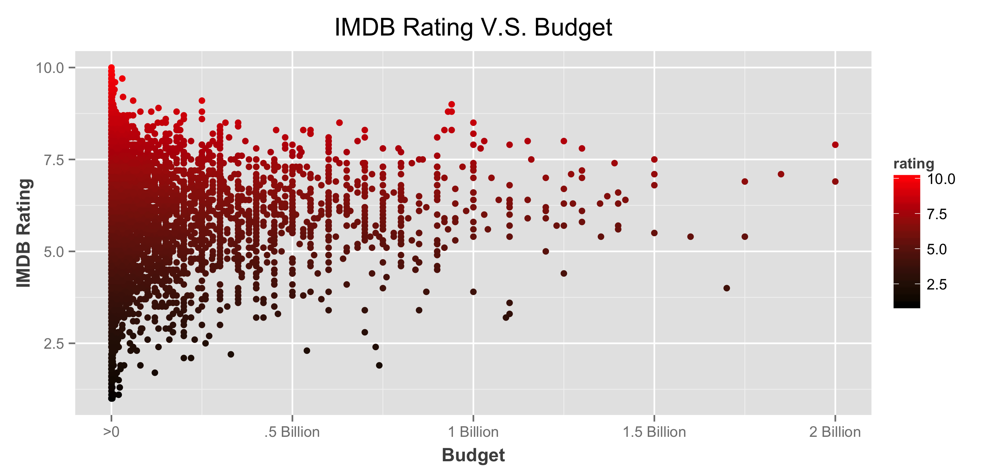
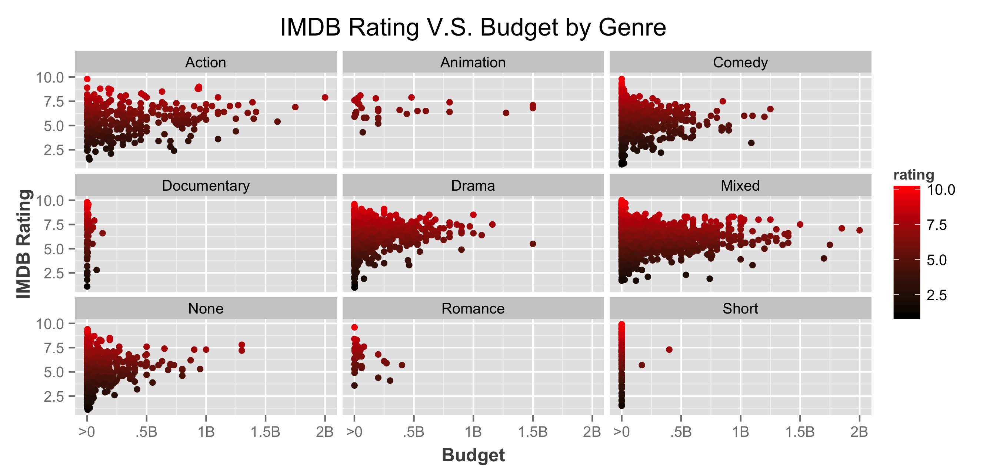
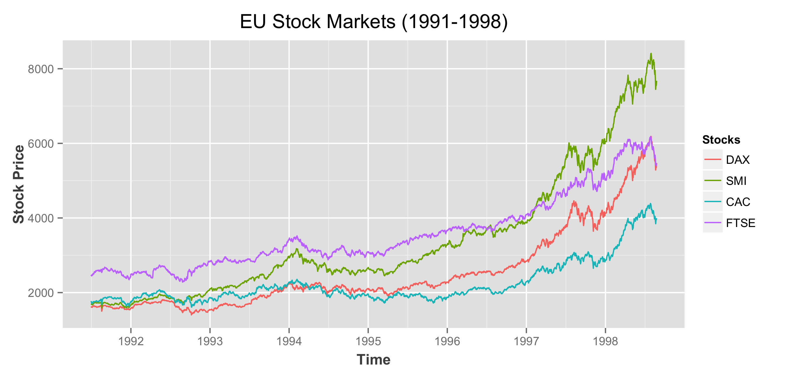

Homework 1: Basic Charts
==============================

| **Name**  | MongYun Lee |
|----------:|:-------------|
| **Email** | mlee37@dons.usfca.edu|

## Instructions ##

The following packages must be installed prior to running this code:

- `ggplot2`
- `reshape`

To run this code, please enter the following code in R:

```
library(ggplot2)
library(reshape)
```

Despite the "Genre" and "eu" code that have been provided in the homework 1 instruction, we still need to modify our data to proceed. 

- Filter out any rows that have a budget value less than or equal to 0 in the movies dataset.

```
movies<-subset(movies, budget>0)
```

- Group the stocks, `DAX`, `SMI`, `CAC`, `FTSE` in `eu` by using the `melt()` in `reshape`
  Since `reshape` can't read ts, we will have to unclass variable `time` in `eu` first.

```
eu[sapply(eu, is.ts)] <-lapply(eu[sapply(eu, is.ts)], unclass)
```
```
newframe<- melt(eu, id.vars=c("time"), value.name="price", variable.name="stock")
```

## Discussion ##
In your discussion, include each of the four images generated and a brief discussion following each image about the customization performed. For example, how did you use color? Why did you move the legend? (And so on.) The discussion for each image should be limited to a single paragraph with approximately 3 to 5 sentences.


For the "IMDB Rating V.S. Budget" graph, I used `scale_colour_gradient(low="black", high="red")` to show the relationship between budget and IMDB Rating. Since, red (warm color) is energizing. It excites the emotions and movtivates us to take action and black gives people an impression of darkness. I believe by using the gradient, the graphs shows a strong relativity. I also changed the color of `xlab` and `ylab` to `grey30`, because I think it makes the grapgh not as sharpe as using the color black. I also made a change in the text of axis x, so that the audience may have process the numbers faster.


For the "numerber of movies in Genres", I decided to use only one color,`royalblue1`, on the bars since the color provides a sense of stablenes and the color is warm enough to attract attention.Also, in this case giving each bar different color will not provide any more information. I also cleared out the background grind and made the bars descending to show more of the relative relationship between each genre. I believe most viewers will have little interest in the actual numbers, after all is the ratio that speaks the most. I did a little ajustment on the position and color on the `xlab` and `ylab` to make it more reader-friendly. At last, since we are only using one color here, I got rid of the legend.


For the "IMDB Rating V.S. Budget by Genre". I used the same method as "IMDB Rating V.S. Budget" to show the consistency. Since the lenght of x axis in this graph is shorter than the one in the previous graph, I changed the text in x axis again to make it more reader-friendly. Beside that I also did some adjustments including, name, color, font size and position on `xlab`, `ylab` and `ggtitle`. 


For the "EU Stock Markets (1991-1998)". I used the `melt()` in `reshape` to group the stocks. After plotting the lines to the graph, I added more breaks on the x axis, so that the audience will have a clearer view on what was happening every year. Again, I did the same adjustments as before on `xlab`, `ylab` and `ggtitle`. In order to make the legend more understandable, I changed the name of the legend. At last, I added colors on the lines just to attract more attentions. 
