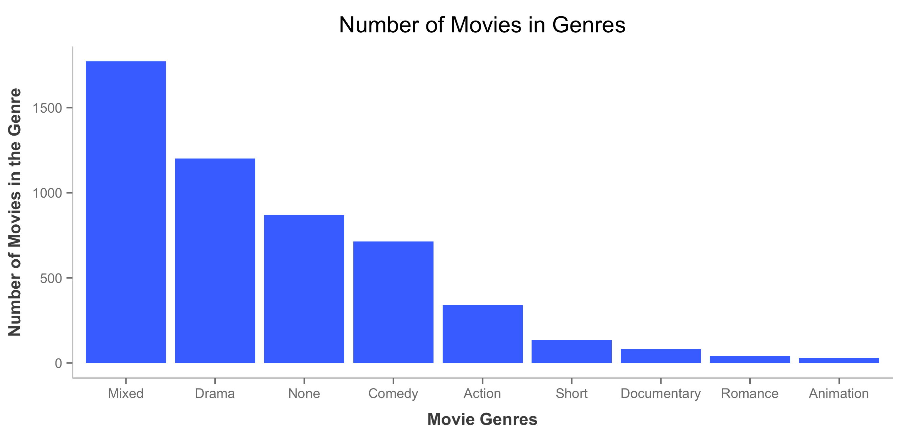

Homework 1: Basic Charts
==============================

| **Name**  | MongYun Lee |
|----------:|:-------------|
| **Email** | mlee37@dons.usfca.edu|

## Instructions ##

The following packages must be installed prior to running this code:

- `ggplot2`
- `reshape`

To run this code, please enter the following code in R:

```
library(ggplot2)
library(reshape)
```

Despite the "Genre" and "eu" code that have been provided in the homework 1 instruction, we still need to modify our data to proceed. 

- Filter out any rows that have a budget value less than or equal to 0 in the movies dataset.

```
movies<-subset(movies, budget>0)
```

- Group the stocks, `DAX`, `SMI`, `CAC`, `FTSE` in `eu` by using the `melt()` in `reshape`
  Since `reshape` can't read ts, we will have to unclass variable `time` in `eu` first.

```
eu[sapply(eu, is.ts)] <-lapply(eu[sapply(eu, is.ts)], unclass)
```
```
newframe<- melt(eu, id.vars=c("time"), value.name="price", variable.name="stock")
```

## Discussion ##
In your discussion, include each of the four images generated and a brief discussion following each image about the customization performed. For example, how did you use color? Why did you move the legend? (And so on.) The discussion for each image should be limited to a single paragraph with approximately 3 to 5 sentences.


