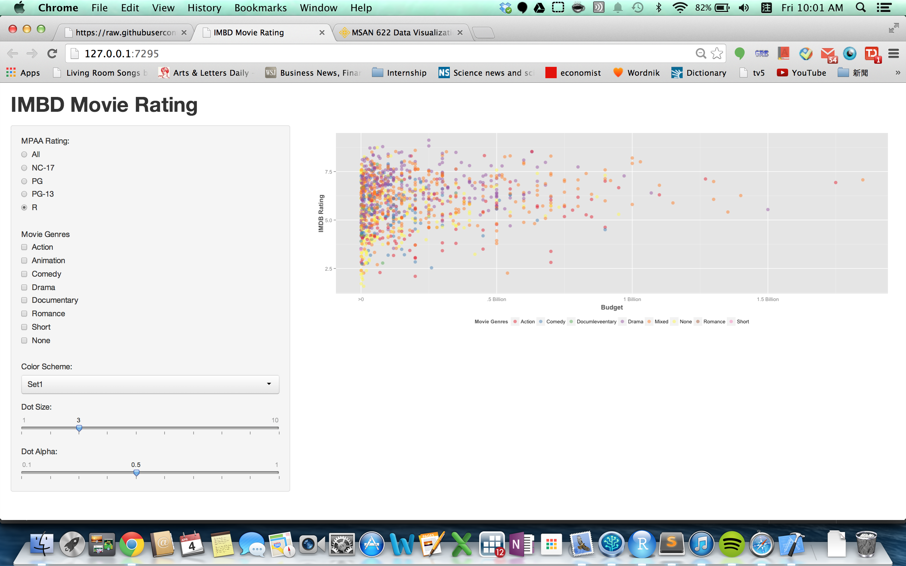
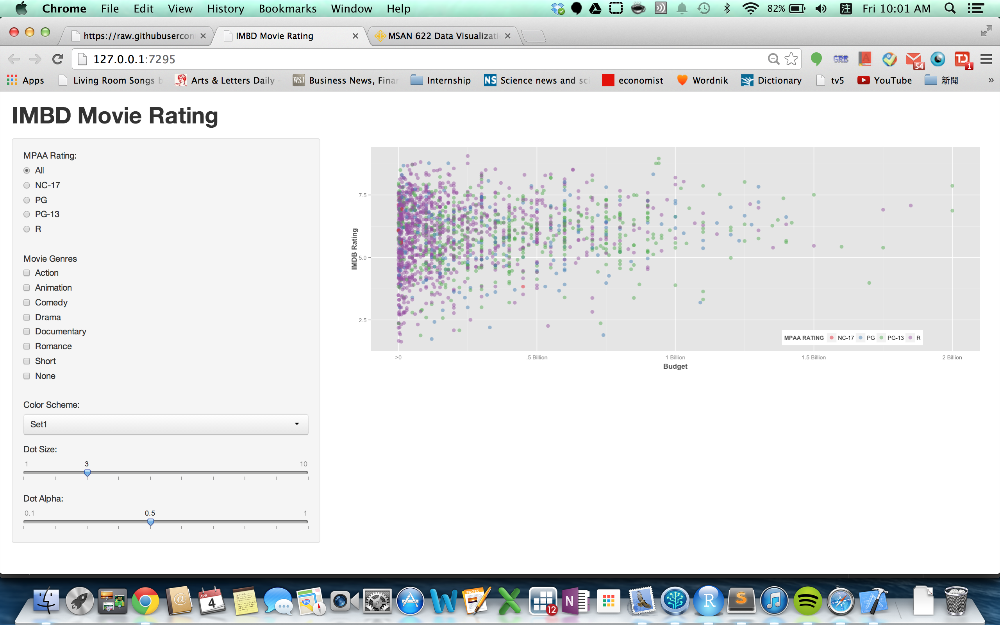

Homework 2: Interactivity
==============================

| **Name**  | MongYun Lee |
|----------:|:-------------|
| **Email** | mlee37@dons.usfca.edu |

## Instructions ##

The following packages must be installed prior to running this code:

- `ggplot2`
- `shiny`

To run this code, please enter the following commands in R:

```
library(shiny)
shiny::runGitHub('msan622', 'mong2', 'homework2')
```

This will start the `shiny` app. See below for details on how to interact with the visualization.

## Discussion ##


How does the graph work: 

The most basic thing about this graph is that it can change the color of the graph through **Color Scheme** and that you can change the **Dot Size** and **Dot Alpha** through the sliderbar below. 


The defualt of the graph is to plot all MPAA rating on the graph. When you click on the checkbox in **Movie Genre** you will see that the plot will plot the MPAA rating that's in the choosen genre only. One thing to remember is that while choosing "All" under MPAA Rating, the dot colors are sorted by the rating not by the genre. 


If you choose any other options beside "All" under MPAA Rating, you will notice that the dot colors are now sorted by the Movie Genre. By clicking on different checkboxes under Movie Genres, we can see the distribution of each genre under a certain MPAA rating. 


here you can see the change in the size of the dot and the alpha of the dot, also how the checkboxes work.

As for the customize part, I've changed the position and the color of the legend. Also the legend color and position for "All" under MPAA rating is different from all the other options, so to notify the viewer that the color of the dots now means differently. I also copy and paste the theme of the plot from previous homework, so there's some adjustment on the color and position of `xlab` and `ylab`. There is also changes on the text of x axis. So other small changes in the gragh is that I took out the ticks on x axis, since the distance and the difference between each block is so big, I believe it will be easy for the viewer to receive the information that x-axis is providing. On the other hand, the situation of -axis is totally opposite comparing to x-axis, therefor the ticks on y axis remains. I tried to get rid of the minor grind of each side of the axis but found that they still play an important role in providing comparisons.