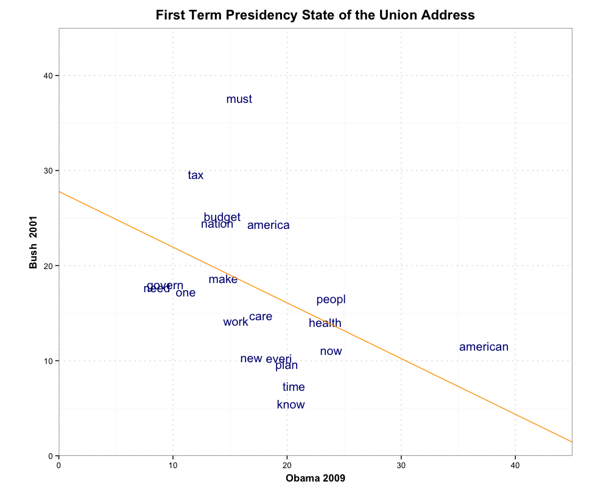
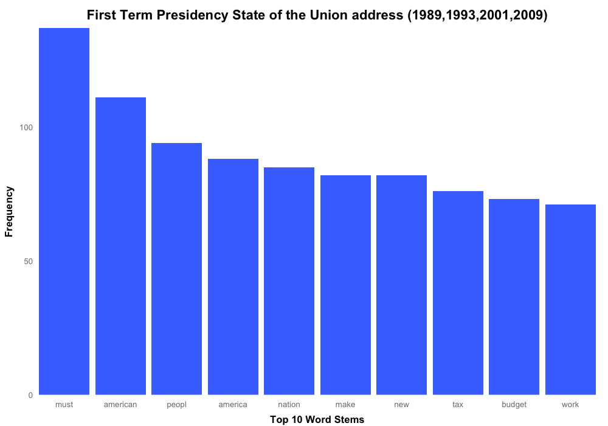
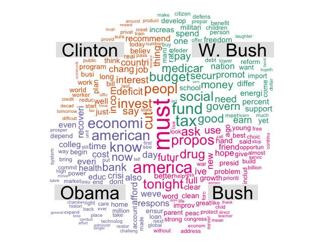

Homework 4: Text Visualization
==============================

| **Name**  | MongYun Lee  |
|----------:|:-------------|
| **Email** | mlee37@dons.usfca.edu |

## Instructions ##

The following packages must be installed prior to running this code: 
-`ggplot2`
-`tm`
-`SnowballC`
-`wordcloud`

To run this code, please enter the following code in R:

```
require(ggplot2)
require(tm)
require(SnowballC)
require(wordcloud)
```

## Discussion ##

Data: State of the Union. 

I picked State of the Union from the four most recent US Presidents and focus on their first term of presidency. 
People always says that being a president of the United States is the peak of one's political career. 
I believe this data visualization can give the audience a slight view of the passion and 
excitement of those just elected former and current presidents. 

I don't really know what words should be remove, so I picked the one on sample.

Removed Words:
will, can, get, that, year, let



First, I did a scatter plot on the most frequent words that were used by President Bush and President Obama. From the plot, it shows that President Obama loves "American" way more than President Bush and that President Bush is a MUST person. They care pretty much equally on **work**, **care** and **health**, which I assume that health care and work have been the hot topic since 2001. Might because of the huge deficit that the Bush administration had left to the Obama administration, we can tell from the plot that President Obama didn't like to talk about MONEY (**budget** and **tax**)

For the scatter plot, I changed the color of the text plots nad the slope line so that the grapgh will look more friendly. I beleive navy+orange is one of the most neutral color combinations. The grapgh shows only the top 20 most frequently used words. As you can easily tell from the graph,I've changed the title of both axises and added a plot title. All the titles are adjusted in my favorite form, including the postion, face, and size. I've also changed the major grid to dotted line so that it looks better. I've also fixed the size of the coord. 


Second, I did a bar chart for the most frequent words that have been used since the old President Bush. With no surprises, **MUST** is the word that politicians love the most. As the President of United States, you have to emphasized **American** and **America**. Just think it is very interesting that we got the phrase ** Must American People America
Nation Make New Tax Budget Work** (Depends on where you are going to put the comma :) )

I decided to use only one color,`royalblue1`, on the bars since the color provides a sense of stablenes and the color is warm enough to attract attention.Also, in this case giving each bar different color will not provide any more information. I also cleared out the background grind, ticks and made the bars descending to show more of the relative relationship between each words. I believe most viewers will have little interest in the actual numbers, after all is the ratio that speaks the most. I did a little ajustment on the position and color on the `xlab` and `ylab` to make it more reader-friendly. At last, since we are only using one color here, I got rid of the legend.


For the last one, I did a comparison wordcloud so that the audiances can have a bigger picture on what word each president love to say. I have to mention the word **Must**, I understand it is a little bit confusing why old President Bush got the huge **MUST** instead of his son, President W. Bush. The fact is President Obama is the only president that does not like the word **Must** (I guess it's never a good thing to demand or over-promised). We can see that for old President Bush, drug was still a problem (I guess he didn't think that drug addict will be such a common thing ten years later). I guess money was the reason that old President Bush couldn't make it to the second term. We can see from the cloud that he is the only one that cares like a father (drug, parent, peace, clean, clear, growth, friend, hope and future). Others are like bankers or your financial planner (invest, economy, budget, fund, tax, deficit, bank, cost and money) All of the aboves are purely my assumptions. The only thing that I can be sure of is that old President Bush was super duper excited that night.(**tonight**)

The reason that I wrote a longer paragragh above is because I didn't do much on the coding and customizing. I have to admit I didn't understand what's the point of learning text minning at the begin. But after looking at the graphs and gathering information from it, I think this is so far the most interesting homework we have done.
