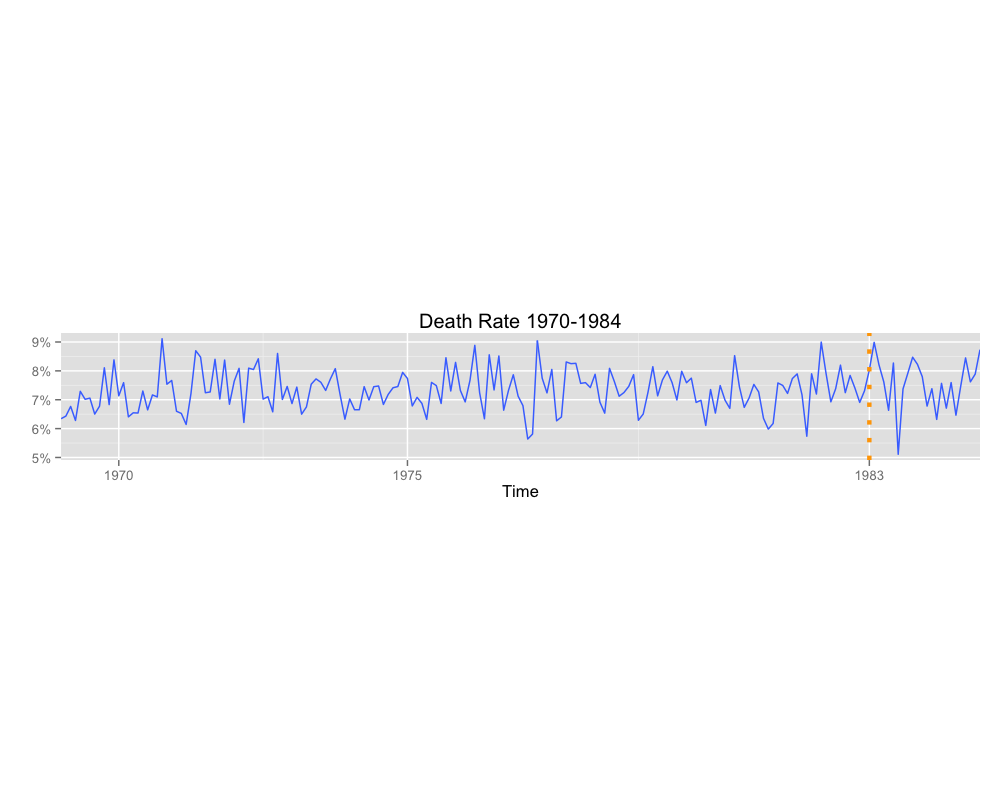

Homework 5: Time Series Visualization
==============================

| **Name**  | MongYun Lee |
|----------:|:-------------|
| **Email** | mlee37@dons.usfca.edu |

## Instructions ##

require to use 

- `library(reshape2)`
- `library(ggplot2)`

## Discussion ##

I choose to go with option 1 which is to provide three visualizations because I don’t see how the interactive part can provide more information.

**Heat Map** 

Since I can really find any specific relationship between the gas price and the number of death and injured, I've decided to look at the historical gas price from 1970 - 1984. From the Heat Map, we can easily see how the gas price change over each month during the time period. 

For the customize part, I got rid of ticks and axis labels and I changed the position of the legend as well. 

**Muliti Line Graph**

I use `melt()` in `reshape2` to group both **front** and **rear**. After plotting the lines to the graph, I customized the breaks on the x axis, so that the audience will have a clearer view on what was happening before the seatbelt law and after the seatbelt law. Again, I did the same adjustments as before on `xlab`, `ylab` and `legend`, and got rid off title. At last, I added a vertical line at 1983, the year that seatbelt law has started. 

**Single Line Graph**

After adding the time in to the data, I decided to do a death rate from 1970-1984. I divided **killed driver** by **total driver** to get the percentage for death rate. After plotting the grapgh, I did some customize stuff of the grapgh, including getting rid off y-axis label and legend. I also added a vertical line on 1983 to indicate the year that seatbelt law has started such that it will be easier for the viewer to determine whether there's a difference before and after the law.
